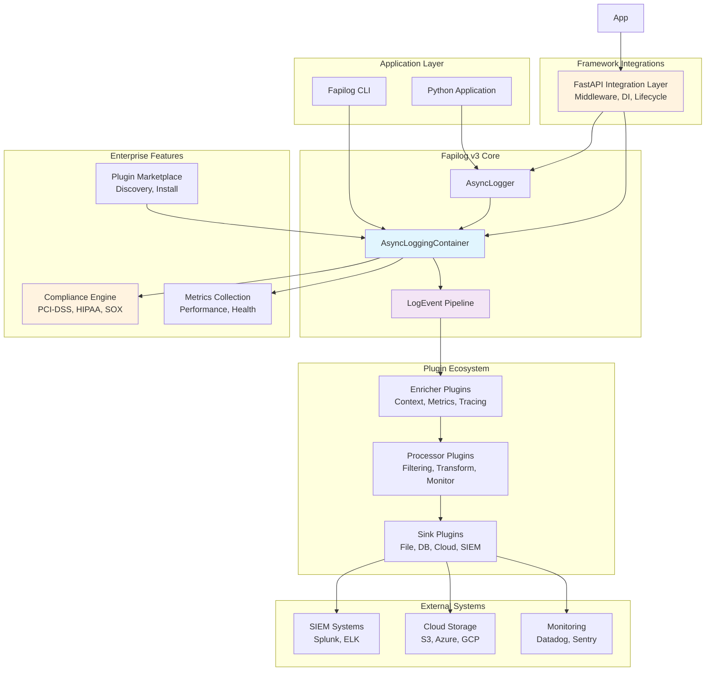

# High Level Architecture

## Technical Summary

Fapilog v3 employs a revolutionary **async-first pipeline architecture** designed for universal adoption from individual developers to enterprise-scale applications. The system utilizes **zero-copy operations** and **parallel processing** to achieve 500K-2M events/second throughput while maintaining perfect container isolation. Core architectural patterns include an **extensible plugin ecosystem**, **enterprise compliance framework**, and **async-first component factory pattern** that recreates v2 excellence in a pure async context. This architecture directly supports the PRD goals of achieving 9/10+ scores across all architectural categories while enabling both developer productivity and enterprise-grade reliability.

## High Level Overview

**Architectural Style:** **Async-First Monolithic Library** with **Plugin-Based Extensibility**

- **Repository Structure:** Monorepo (as specified in PRD technical assumptions)
- **Service Architecture:** Monolithic core with clear separation through plugin system
- **Primary Data Flow:** Async pipeline with parallel enrichment → processing → sink delivery
- **Key Architectural Decisions:**
  - Pure async-first design (no sync/async mixing)
  - Zero-copy operations throughout the pipeline
  - Container isolation with zero global state
  - Universal plugin ecosystem for extensibility
  - Enterprise compliance built into core architecture

## High Level Project Diagram

## Architectural and Design Patterns

Based on your PRD requirements and v2 excellence patterns, here are the key patterns that will guide the architecture:

- **Async-First Pipeline Pattern:** Pure async/await throughout the logging pipeline with parallel processing - _Rationale:_ Achieves 500K-2M events/second throughput target and 90% latency reduction from PRD requirements

- **Container Isolation Pattern:** Perfect isolation with zero global state using async context managers - _Rationale:_ Recreates v2 excellence while enabling async patterns and preventing race conditions

- **Dependency Injection Pattern:** Constructor-based DI for plugins, containers, and core components - _Rationale:_ Enables testability, container isolation, plugin flexibility, and enterprise customization without tight coupling

- **Zero-Copy Operations Pattern:** Memory views and efficient serialization throughout pipeline - _Rationale:_ Achieves 80% memory reduction target and optimal performance for enterprise-scale deployments

- **Universal Plugin Architecture:** Extensible sinks, processors, and enrichers with async interfaces - _Rationale:_ Enables ecosystem growth (100+ plugins by v3.1) and universal adoption from developers to enterprise

- **Enterprise Compliance Pattern:** Built-in PCI-DSS, HIPAA, SOX compliance with audit trails - _Rationale:_ Addresses critical enterprise requirements identified in market research

- **Async Component Factory Pattern:** Revolutionary async component factory with zero-copy operations - _Rationale:_ Recreates v2 factory excellence while enabling async-first instantiation and configuration

- **Event-Driven Architecture:** Rich metadata events with categories and severity levels - _Rationale:_ Foundation for future alerting capabilities while maintaining structured logging excellence
